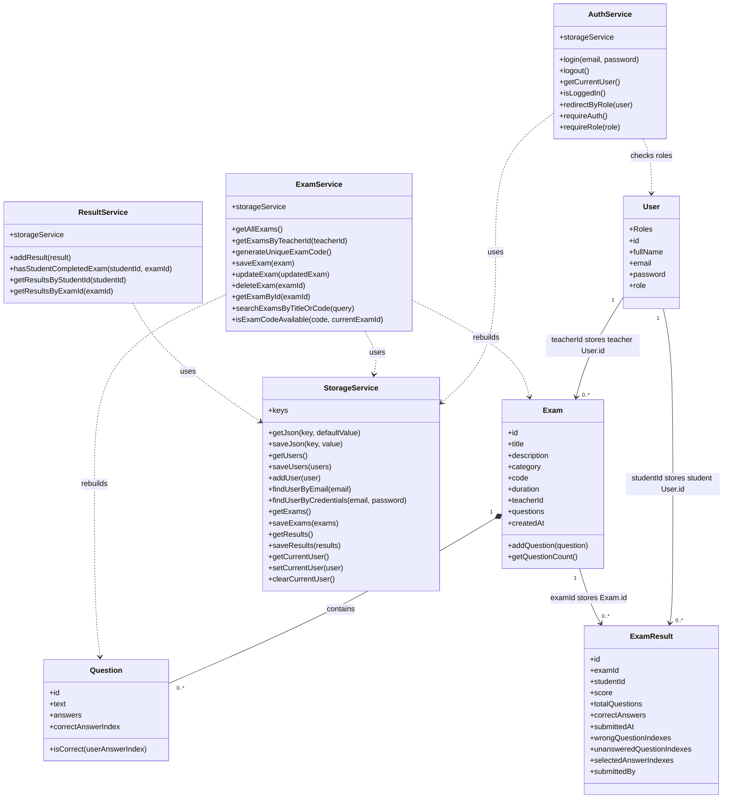

# Exam Management System

A client-side web application for creating, taking, and reviewing exams. The project was built as a web development student project and uses browser storage instead of a backend server or database.

## Technologies

- HTML
- CSS
- JavaScript
- ES Modules
- OOP classes
- JSON
- localStorage
- Bootstrap

## How To Run

Open `index.html` in a browser, or use VS Code Live Server for a smoother local development experience.

This project has no backend, server, or external database. All data is saved in the browser using `localStorage`.

## User Roles

- **Teacher** - creates and manages exams.
- **Student** - searches for exams, takes available exams, and reviews grades.

## Teacher Features

- Register and log in as a teacher.
- Create exams with a title, description, category, duration, and generated exam code.
- Edit exam details.
- Add, edit, and delete multiple-choice questions.
- Delete exams with confirmation.
- View student results for each exam.
- Review wrong and unanswered question numbers for submitted results.

## Student Features

- Register and log in as a student.
- Search exams by title or exam code.
- View available exams and their question count.
- Take exams that already contain questions.
- See the score immediately after submission.
- View completed exam history.
- View average score and highest score.

## Project Structure

- `index.html` - public home page.
- `register.html` / `login.html` - authentication pages.
- `teacher-dashboard.html` - teacher exam dashboard.
- `exam-details.html` - teacher exam editing, question management, and result review.
- `student-dashboard.html` - student score summary and result history.
- `search-exam.html` - student exam search page.
- `take-exam.html` - student exam-taking page.
- `css/` - shared styling.
- `js/models/` - data classes such as `User`, `Exam`, `Question`, and `ExamResult`.
- `js/services/` - business logic and localStorage access.
- `js/pages/` - page-specific scripts that connect HTML, services, and DOM events.
- `js/ui/` - original UI helper code kept from the classroom version where relevant.

## Architecture

The project is organized into small modules:

- **Models** represent the main data entities.
- **Services** contain business logic and storage-related operations.
- **Page scripts** control each page, listen to DOM events, and call services.
- **StorageService** centralizes all `localStorage` reads and writes.
- **AuthService** handles login, logout, session checks, and role-based redirects.

This keeps data structure, storage logic, and page behavior separated while still staying simple enough for a client-side course project.

## OOP Diagram

Models represent the system's data entities. Services manage authentication, exams, results, and persistence. Page modules connect the services to the DOM and are therefore not shown as OOP classes.

## Data Persistence

The application stores data in `localStorage` as JSON.

Stored data includes:

- `users`
- `exams`
- `results`
- `currentUser`

Because the data is stored only in the browser, clearing browser storage will remove the saved users, exams, sessions, and results.

## Optional Features Included

- Exam timer with automatic submission.
- Exam categories.
- Generated exam codes.
- Student grade history.
- Student average and highest score.
- Teacher review of student results.
- Confirmation dialogs before deleting exams or questions.

## Manual Testing Checklist

1. Register a teacher account.
2. Log in as the teacher.
3. Create a new exam.
4. Add questions to the exam.
5. Edit exam details and verify the changes are saved.
6. Register a student account.
7. Log in as the student.
8. Search for the exam by title or exam code.
9. Take the exam and submit answers.
10. View the result on the student dashboard.
11. Log back in as the teacher.
12. Open the exam details page and view student results.
13. Test that an exam with zero questions does not appear in the student's available exam search results.
14. Test protected pages and role redirects:
    - Logged-out users should be redirected to login.
    - Students should not access teacher pages.
    - Teachers should not access student pages.
    - Teachers should not access exams owned by another teacher.

## Known Limitations

- Data is stored only in the browser `localStorage`.
- This is not a secure production authentication system.
- No backend database is used.
- Clearing browser storage removes all saved data.
- The app is intended for learning and demonstration, not production use.
